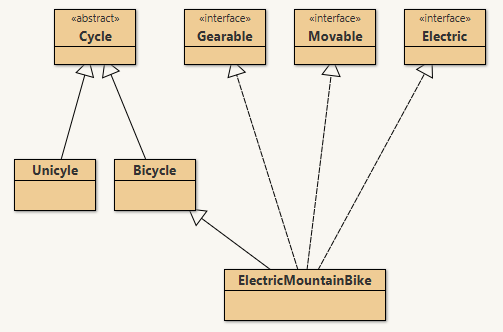

# JavaAdvClasses
 _(derived from CISC191M4AdvancedClasses)_


Java Test Driven Development (TDD) project to program Java classes with unit testing ( with **JUnit** )

________


# San Diego Mesa College CISC 191 Programming Challenges
Programming challenges for San Diego Community College CISC 191 Intermediate Java classes.

Created by
- Professor Dr. Tasha Frankie
- and Professor [Allan Schougaard](https://github.com/schougaard), San Diego Mesa College.

With contributions from: 
- Dom David,
- [Dan Sullivan](https://github.com/uid100)

________

## Assignment Overview
Inheritance and polymorphism are two important concepts in Java programming that allow for code reusability, flexibility, and extensibility.

Inheritance allows a new class to inherit the properties and methods of an existing class. This can be used to avoid duplicating code and to create a hierarchical relationship between classes. For example, we could create a Vehicle class that has properties and methods for all vehicles, such as getSpeed() and brake(). We could then create more specific classes, such as Car and Truck, that inherit from Vehicle and add their own unique properties and methods.

Polymorphism allows us to have different objects that respond to the same message in different ways. This is achieved through method overriding, where a subclass can provide its own implementation for a method that is also defined in its parent class. For example, the Vehicle class might have a method called move(). The Car class could override this method to provide its own implementation that describes how a car moves. This allows us to write code that is more flexible and extensible, as we don't have to worry about the specific type of object that we are working with.

Inheritance and polymorphism are powerful tools that can be used to improve the quality and maintainability of Java code. By using these concepts effectively, we can write code that is more reusable, flexible, and extensible.

The goal of this assignment is to expand on your knowledge of writing classes in java by incorporating inheritance. You will implement several java classes some of which are connected via the is-a relationship and some via the has-a relationship. As always, other content such as arrays may show up in this programming assignment. In this challenge you are going to write code to help a bike shop.

________

## Instructions

## _(Open the Project)_
1. From the **<> Code** dropdown link in the repository (above), download the Zip file to your computer.
2. Extract the files to your working folder
3. Open Eclipse and import the project. 
   - You can use File>Import menu item or right-click in the Package Manager and choose Import.
   - select General>Projects from Folder or Archive
   - navigate into the project until you see the `bin` and `src` folders, and choose *open*
4. Expand the project in the package explorer and find the .java files below the **src** folder.

## _(Complete the Assignment)_


In this challenge you are going to write code to relating to a bike shop. 

This programming assignment is tested using JUnit testing so the Tester class will help guide you in finding the relationships between the classes along with this programming assignment spec. 

The project comes with several files which are a mix of classes, subclasses, abstract classes, interfaces, and the tester class. A lot is going on, so take it one test method at a time

- Cycle: Abstract superclass
      - Unicycle: Subclass of Cycle
      - Bicycle:  Subclass of Cycle
      - ElectricMountainBike: Subclass of Cycle
- Gearable / Movable: Interfaces
  
Similar to previous assignments, you will use the tester class to guide you in completing this programming assignment along with this programming assignment guide.

___________

## Programming Task(s)

<details open>
    <summary>Cycle</summary>
 
A Cycle is an abstract super-class that represents a Cycle object containing a frame number attribute with numerous instance methods.

Abstract classes are not meant to be directly usable in programming. A user is meant to implement a class that extends the abstract class. 

In this programming assignment, your job is to implement a couple of sub-classes that will extend this class.

When a class extends an abstract class, it must implement all abstract methods. Look at the code now and notice several methods with no bodies. These are declared abstract as the subclass is the one that must implement their logic. The super-class, however, dictates the method header and the fact that they must be implemented in the subclass. This will make more sense once you start writing the sub-classes.

Scan the Cycle class and complete the class as you would any Java class.
1. Complete the constructor
2. Complete any getters/setters (scroll down the class)
3. You will have to revisit what you did in the previous Programming Assignment to solve the serial number aspect of a Boat! The Cycle class needs to keep track of all the frameNumbers that have been "handed-out" similar to how the Boat class kept track of all the serial numbers that have been used. <br />d) The constructor for the Cycle class should assign the unique frameNumber (similar to the serial number of a Cycle object) as well as incrementing whatever variable you have to keep track of the next frame number to be handed out.

</details>

<details open>
     <summary>Unicycle</summary>

1. A Unicycle is-a Cycle</span><span>!
Add the required code to define this relationship between **Cycle** and **Unicycle**!
This should be the class header line! Change it by adding _**extends Cycle**_
2. Once you have **Unicycle** extending **Cycle**, you need a constructor that takes in a
```
String.public Unicycle(String newMake) {
    super(newMake); //the call to super invokes the matching constructor in the superclass.
}
3. When a non-abstract class (Unicycle) extends an abstract class (Cycle) then it must implement ALL abstract methods from the parent class. Eclipse can actually do it for you automatically by accepting the auto-suggested correction! Hover over the **Unicycle** error it should explain the compile error. _The type Unicycle must implement the inherited abstract method getColor()
Select the first suggested fix: add unimplemented methods.
You may also implement these manually!
4. Once you use the auto-suggest fix, you will find that it gives you the basic stubs for the required methods. Go back and clean them up now by adding the `public` keyword modifier as well as finishing their logic. They should have nonsensical bodies that just make the compiler happy. This is similar to what you have seen in previous programming assignments such as the dummy return lines above.
5. Fix `getNumberOfWheels()` so that it returns 1 since unicycles have one wheel.
6. Add an attribute to keep track of the color of a `Unicycle` object. At the top of the `Unicycle` class, it should look like this:
```
private Color color; //a Unicycle has-a color
```
7. Complete the `getColor`() method so that it's `public` and returns the `color` attribute.
8. Complete the setter for the `color` attribute.

</details>
<details open>
    <summary>Bicycle/ElectricMountainBike</summary>

- Alter these two classes so that they extend the correct class. See the diagram in the Assignment Overview as a reminder. <br />After adding the relationship(s), you should be able to say that a Bicycle is-a Cycle and an ElectricMountainBike is-a Bicycle out loud. This portion demonstrates multi-level inheritance (NOT to be confused with multiple inheritance - not supported in Java).
- Focus on `Bicycle`
1. Add the required methods which are all the abstract methods from the Cycle class. This is similar to what was required of you in Unicycle.
2. Add any required attributes/fields in this class if it needs to keep track of something specific to a Bicycle

- `ElectricMountainBike`
If you have done everything correctly, the ElectricMountainBike class should be set up to inherit from the Bicycle class which means there's not much code in here other than the Constructor. Further changes may be required for the next testers.

Why is there such little code here? You are making use of inheritance to inherit public methods from super-classes. All public or protected methods and instance variables are directly inherited by sub-classes.

</details>
<details open>
    <summary>Gearable/Movable</summary>

1. Look at the Gearable.java and Movable.java files. What do you notice? Read up on interfaces from the book or as a quick reference <a href="https://www.w3schools.com/java/java_interface.asp" target="_blank" rel="noopener">at W3 Schools</a>.
2. Revisit the diagram from the Assignment Overview. You will notice that `ElectricMountainBike` is `Gearable, Movable`, and `Electric`
    - In Java, classes can _implement_ interfaces. Alter the class header of `ElectricMountainBike` so that it implements the interfaces. A Java class can implement more than one interface by listing them comma-separated in the class header. Ex:
```public class Tesla extends Car implements Drivable, Electric { ...```
3. Add the methods from the Interfaces into the `ElectricMountainBike` class similar to how you added the abstract classes from the `Cycle` class for the subclasses.


It was mentioned earlier that multiple inheritance is not possible in Java. However, the mechanism is pretty much achieved through the use of interfaces. Read up <a class="inline_disabled" title="Link" href="https://www.geeksforgeeks.org/why-java-doesnt-support-multiple-inheritance/" target="_blank" rel="noopener">on Geeks for Geeks</a> on why multiple inheritance isn't implemented in Java and must be solved via interfaces.

</details>

___________

## Complete and zip the project
1. Run and add the code to the src folder until the tests are successful.
2. Uncomment each test case in the **Test** file (`TestAdvancedClasses.java`), one at a time. 
Do not modify the content in this file except to uncomment the tests. Add and modify class files
as needed for the tests to pass.
3. Review and refactor any of the code as needed:
    - be sure your code follows good coding practices and coding style and standards.
    - update the javadoc comments at the top of the file to add your name as author
    - update the comments for each method in the file.
4. Export the project as a zip file and submit your work.

___________

## Rubric

[Rubric](Rubric.md)


___________

_this repository is a subset of the CISC191 exercises. It is derived from the CISC191ProgrammingChallenges 
activity hosted by Professor Allan Schougaard, San Diego Mesa College, and not a direct fork._

_This project is to decompose that repository into git submodules_
